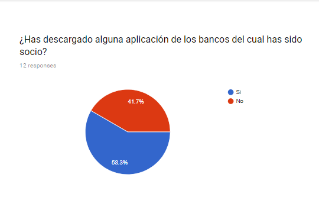
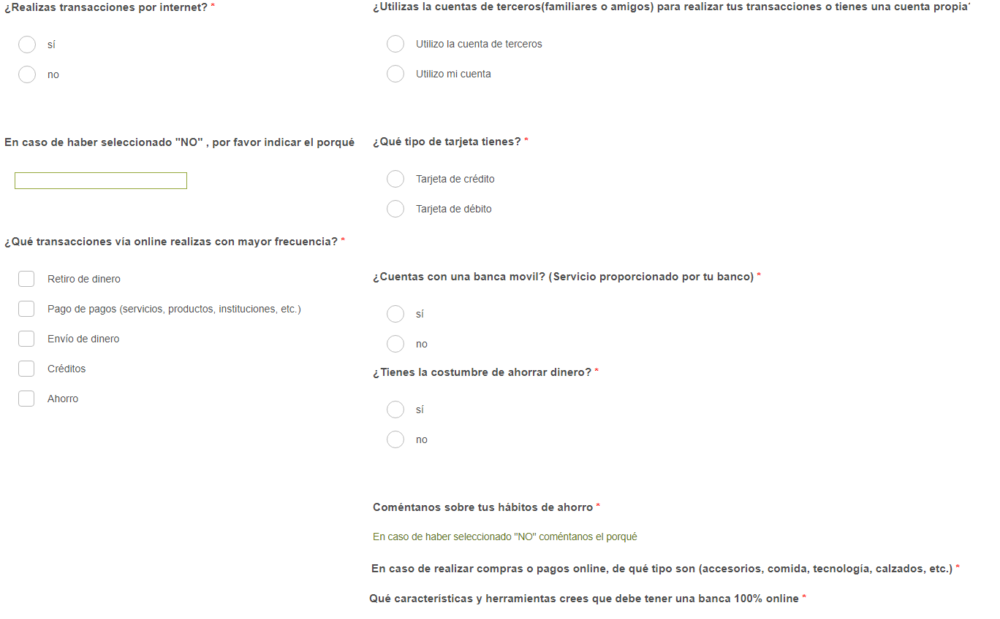
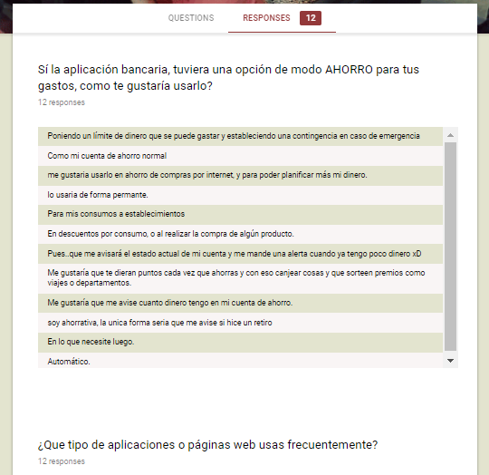
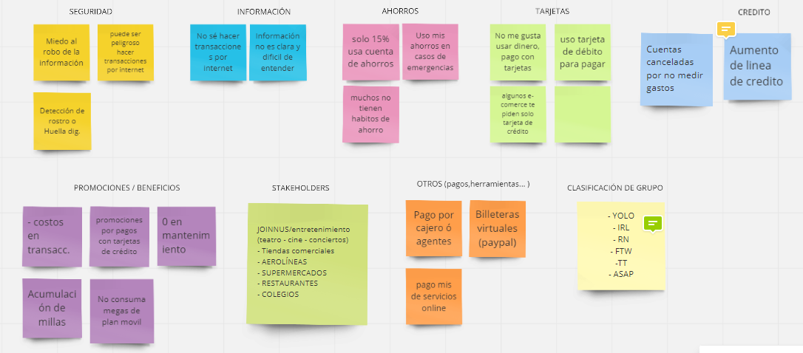
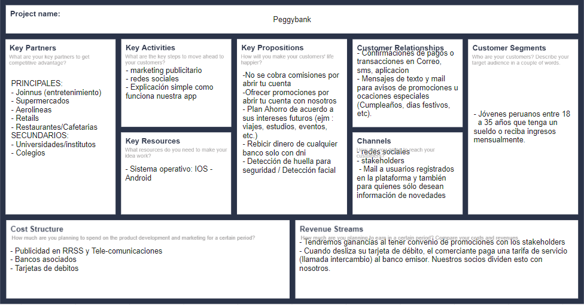
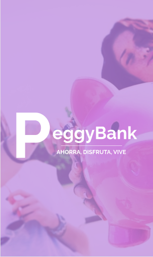

# Banco para millenials
"Peggy Bank" es un proyecto de banca enfocado en millenials peruanos que tienen una cuenta bancaria o hacen uso de algún producto financiero.

## Integrantes
  - Franshesca Quezada
  - Maythe Infante

# Tabla de Contenido
- [Descubrimiento e investigación](#investigación)
   - [Research Cuantitativo](#)
   - [Research Cualitativo](#)
   - [Encuestas y entrevistas](#)
- [Sintesis y definición](#sintesis)
  - [Análisis de las encuestas y entrevistas](#)
  - [Affinity Mapping](#)
  - [User persona](#)
  - [Storytelling](#)
- [Ideación del producto](#)
  - [Canvas de Modelo de negocio](#)
- [Protipando](#)
  - [Protipo versión 1](#)
  - [Customer Journey](#)
  - [Protipo versión 2](#)
- [User testing](#)

## Descubrimiento e investigación
>¿Por qué existen los bancos?
>¿Cuál es su objetivo?
>¿Quienes son los millenials o generación "Y"?
>¿Qué características tienen?

### Research Cuantitativo
Vivimos en un mundo cada vez más bancarizado:
entre 2011 y 2014 unas 700 millones de personas se convirtieron en titulares de cuentas en entidades o proveedores de servicios de dinero móvil, mientras que el número de personas no vinculadas a alguno de estos sistemas cayó un 20%, hasta los 2.000 millones, según el informe Global Findex del Banco Mundial. En 2014, el 58% de las mujeres tenía una cuenta en una entidad, frente al 65% de hombres.

De acuerdo con un estudio sobre el perfil crediticio de los 6,5 millones de ‘millennials’ peruanos (personas entre 18 y 30 años), elaborado por Equifax (empresa dueña de Infocorp), 2,2 millones de estos jóvenes están bancarizados, y de ellos, el 40,9% se encuentra en la categoría más baja de probabilidad de pago de sus deudas, en otras palabras, en alta probabilidad de entrar en morosidad.

Hasta el 2017 un 73% de los millennials peruanos tiene un smartphone a la mano.En el segmento A y B la cifra crece a un 95% y baja a un 60% para los estratos de menor poder adquisitivo (D y E).

### Research Cualitativo
>“Todos los millennials son diferentes de acuerdo a su país de origen”, pero la globalización ha hecho que sean >más similares entre sí, en comparación a las generaciones pasadas.

### Encuestas y entrevistas
Como parte de nuestra investigación realizamos dos tipos de encuestas. La primera encuesta se realizó a un público millennials entre 18 a 25 años de edad con el fin de conocer más sobre el comportamiendo de este grupo en el relación a sus cuentas bancarias, hábitos de consumo y hábitos de ahorro.

#### Encuesta N° 1 :

#### Encuesta N°2:

Para ver más sobre la encuesta dada, [Click Aqui](https://docs.google.com/forms/d/1WMbbFVPTQrjaOzwvj72N88PzAmgEKu8uMIh_QwR2BFA/edit#responses)

## Sintesís y definición  
En esta siguienta etapa, hemos definido los puntos más resaltante e importantes para poder crear nuestra producto de banca digital en base de las necesidades de los millenials. A continuación estaremos expicando los resultados de las entrevistas personales y encuesta virtuales.

### Analísis de las encuestas y entrevistas:
Al terminó de ambas investigaciones hemos rescatado la siguiente información:

  - Rango de edad de encuestados: 18-28 años

  - Los millenials al sacar una tarjeta de débito o crédito esperan tener más descuentos o promociones en: comida, supermercados, ropa, viajes, estudios, etc.

  - Descuentos sobre descuentos

  - Sienten inseguridad al realizar compras por internet por temor de robo de información personal

  - 0 mantenimiento en tarjeta

  - Menos costo en transsaciones

  ### Afinity Map

  
  
  Al recolectar la información, nos dimos cuenta que la mayoría de millenials estabán interesados en promociones que podían sacar provecho y que la mayoria no tiene la cultura de ahorro. 

  En la lluvía de ideas, salió la idea de los stakeholders de quienes trabajaríamos de la mano, y que a la vez serían empresas reconocidas donde saldrían ofertas para nuestros clientes.

  **EJEMPLO:**

- Aerolineas: Avianca, LanTam, American Airlines, etc.
- Supermercados: Tottus, Metro, Wong, Plaza vea, Etc.
- Entretenimiento: Cineplanet, Joinnus, Teleticket, etc.
- Restaurantes: Cevicherias, Pollerias, internacionales, Etc.
- Institutos/Universidades

> Para observar el affinity map más detallado, click [aquí](https://realtimeboard.com/app/board/o9J_kzv4XjQ=/)

### User Persona: Pepe

### Storytelling

Link de la historia de Pepé, [aquí]()

### Canvas de Modelo de Negocio:

 

 > Para observar el CMN más detallado, click [aquí](https://realtimeboard.com/app/board/o9J_kzv4XjQ=/)

 ## Prototipo

Se uso Figma para crear el prototipo y Marvel para darle funcionalidad:

Nuestro prototipo se basa en guardar una parte de tu sueldo neto para cumplir tus metas financieras. Sea que quieras regalarte un reloj nuevo o realizar un viaje a Francia para 2, te ayudamos a cumplir TUS sueños. No solo eso! Somos amigos responsables pero a la vez queremos darnos un gustito o 2, ya que trabajamos y es bueno estar relax de vez en cuando, así que aparte de ayudarte cumplir tu sueños, te damos descuentos exclusivos de acorde tus intereses _mientras_ que Peggy sea alimentado! es así de simple. Y comó somos un banco digital, recuerda que puedes pagar tus cuentas, de celular, universidad, etc y realizar tranferencias... Simple, no?

> Para ver el prototipo de manera funcional, click [aquí](https://marvelapp.com/3159d77)
